> Engineers: see [Technical README](TECHNICAL-README.md) for setup, architecture, and API docs.

# talent-tool-mvp

A proof-of-concept recruitment platform built to demonstrate the **Mind + Mothership** architecture -- two interconnected products that together form an AI-powered operating system for modern recruitment agencies.

**Live Demo:**
- Frontend: [talent-tool-mvp.vercel.app](https://talent-tool-mvp.vercel.app)
- Backend API: [talent-tool-mvp-production.up.railway.app](https://talent-tool-mvp-production.up.railway.app)

---

## What is this?

talent-tool-mvp is a working prototype of a dual-product recruitment platform: an external-facing product for hiring managers (**Mind**) and an internal operating system for talent partners and admins (**Mothership**), unified by a shared AI-powered data layer.

The core thesis: **competitors can copy a UI, but they can't easily replicate structured operational signal, real-world feedback loops, and workflow context turned into reliable product intelligence.** This platform demonstrates that defensibility layer.

---

## The Problem

Recruitment agencies today operate with fragmented tools:

| Pain Point | Impact |
|---|---|
| Candidate data scattered across ATS, CRM, LinkedIn, spreadsheets | Talent partners waste hours searching and cross-referencing |
| Manual candidate-to-role matching based on gut feel | Inconsistent quality, missed matches, slow turnaround |
| No structured handoff process between talent partners | Lost context, duplicated effort, attribution disputes |
| Clients have no visibility into the sourcing process | Frustration, constant status requests, slow decision-making |
| No feedback loop from placements back to sourcing | Matching quality never improves |

---

## The Solution

Two products, one shared intelligence layer:

| Product | Users | Purpose |
|---|---|---|
| **Mind** | Hiring managers / clients | Post roles, browse AI-matched candidates, request introductions with transparent pricing |
| **Mothership** | Talent partners + admins | Ingest candidates from any source, run AI matching, manage collections, hand off leads, query the system with natural language |

Both products share a unified data layer with AI-powered candidate extraction, hybrid matching, and a signal-tracking system that makes the platform smarter over time.

---

## Product Architecture

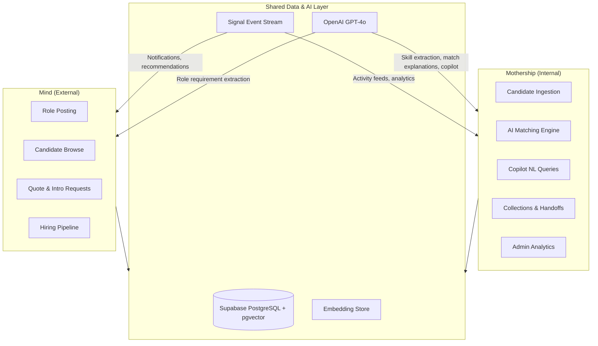

---

## Canonical Data Contracts

Both products build against a shared set of **canonical object definitions** -- the single source of truth for how candidates, roles, matches, and signals are structured across the platform.

```mermaid
graph LR
    subgraph Sources ["Raw Data Sources"]
        S1[Bullhorn ATS]
        S2[HubSpot CRM]
        S3[LinkedIn]
        S4[CV Upload]
    end

    subgraph Contracts ["Canonical Data Contracts"]
        C1[Candidate]
        C2[Role]
        C3[Match]
        C4[Signal]
        C5[Handoff]
        C6[Quote]
    end

    subgraph Consumers ["Product Surfaces"]
        P1[Mind UI]
        P2[Mothership UI]
        P3[Copilot]
        P4[Analytics]
        P5[API Layer]
    end

    Sources -->|Adapter normalizes| Contracts
    Contracts -->|Typed contracts| Consumers
```

This matters because:
- **Every data source normalizes to the same shape.** A candidate from Bullhorn and a candidate from a CV upload are identical once in the system. The adapters are the translation layer, not the product.
- **Frontend and backend share the same type definitions.** Python Pydantic models and TypeScript interfaces are kept in sync -- the contract boundary is explicit, not implicit.
- **New integrations don't require UI changes.** Add a new adapter, implement the canonical interface, and the candidate flows through every existing workflow automatically.

---

## Three Personas

### Talent Partner (Mothership)

The power user. Talent partners ingest candidates from multiple sources, review AI extractions, run matching against open roles, curate collections, and hand off leads to other partners.

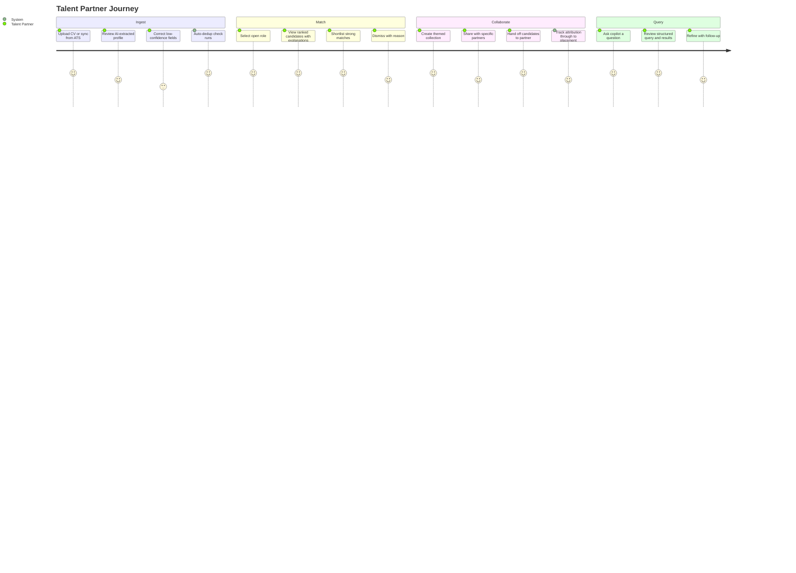

### Client / Hiring Manager (Mind)

The external user. Clients post roles through a guided workflow, browse AI-matched candidates (anonymized until intro), request introductions with transparent pricing, and track their hiring pipeline.

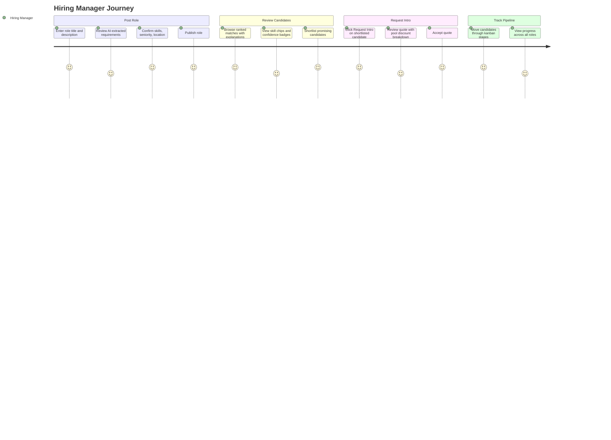

### Admin / Ops (Mothership)

Platform oversight. Admins monitor data quality, review auto-merges, track adapter health, analyze funnel metrics, and use the copilot with full platform-wide access.

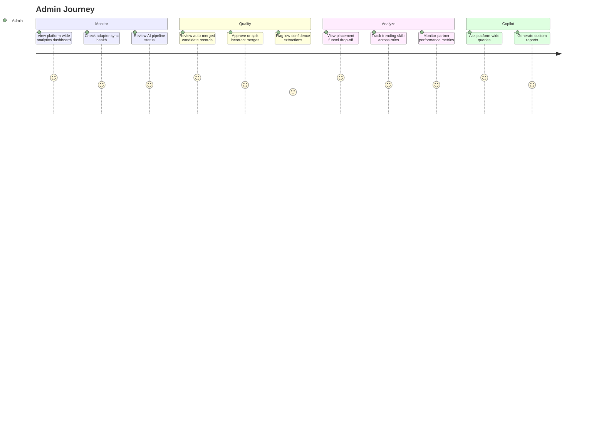

---

## AI-Powered Features

### Skill Extraction from CVs

When a candidate is ingested (via CV upload, text paste, or adapter sync), the AI extracts structured data in real time:

| Extracted Field | Example | Confidence Scoring |
|---|---|---|
| Skills with years | Python (6 years), React (3 years) | Per-field confidence 0-1 |
| Experience timeline | Senior Engineer at Monzo, 2021-2024 | Verified against CV text |
| Seniority level | Senior | Inferred from title + years |
| Salary expectation | 85k-100k GBP | When stated or inferable |
| Availability | Immediate / 1 month / 3 months | From notice period context |
| Industries | Fintech, SaaS | From company + role context |

Fields below 0.7 confidence are highlighted for human review -- the AI suggests, the human confirms.

### Hybrid Matching Pipeline

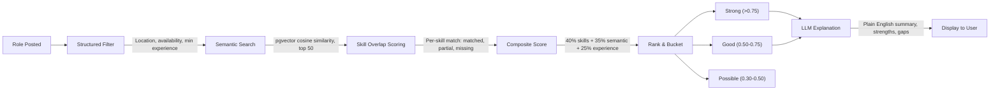

Every match includes:
- A plain-English explanation ("6 years of Python backend experience aligns well with the requirement")
- Bullet-point strengths and gaps
- A one-line recommendation
- Full scoring breakdown available for transparency

### Copilot Natural Language Queries

Talent partners and admins can query the system in plain English:

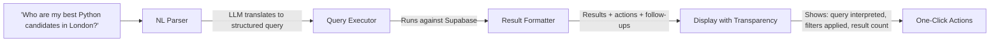

The copilot shows exactly what query it ran -- no black box. Results include one-click actions (shortlist, add to collection, refer to partner) and follow-up suggestions.

---

## Data Engineering

The data layer is designed as a product, not just storage. Every design decision optimises for retrieval, usability, and quality.

### Identity Resolution and Deduplication

When candidates arrive from multiple sources, the system runs a three-strategy dedup pipeline:

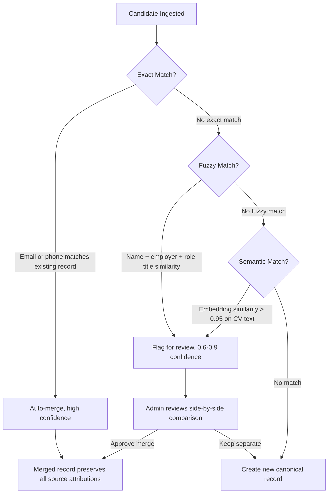

### Signal Layer and Feedback Loops

The signal layer is the platform's instrumentation backbone -- not just analytics, but the data that makes every other feature smarter over time.

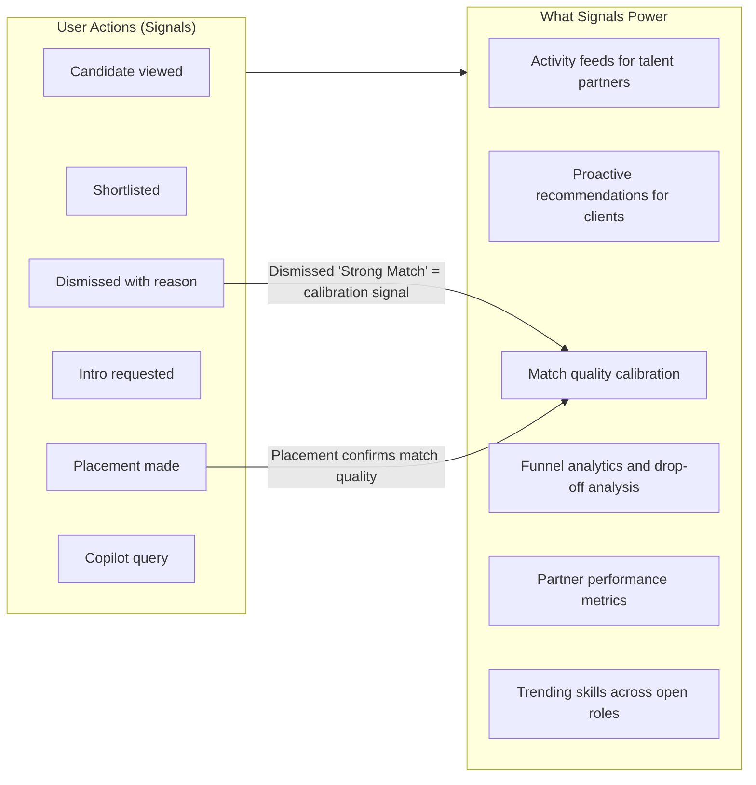

Every user action -- viewing a candidate, shortlisting, dismissing, requesting an intro, making a placement -- emits a structured signal event. These signals don't just populate dashboards; they create feedback loops. When a "Strong Match" candidate gets dismissed, that's a calibration signal. When pre-vetted pool candidates convert to placements faster, that validates the marketplace model.

### Schema Design

- **pgvector HNSW indexes** on candidate and role embeddings for sub-100ms approximate nearest neighbor search
- **Row-Level Security** at the database layer -- talent partners see their candidates plus shared collections, clients see only matched candidates (anonymized), admins see everything
- **JSONB** for semi-structured fields (skills, experience, sources) that need flexible querying without schema migrations
- **Supabase Realtime** on matches, handoffs, quotes, and signals for live updates across all connected clients

---

## Key Workflows

### Candidate Ingestion to Placement

The complete lifecycle of a candidate through the platform:

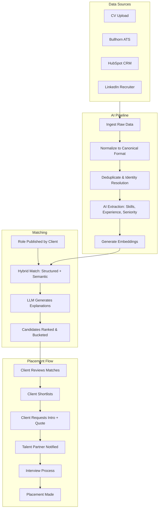

### Handoff Between Talent Partners

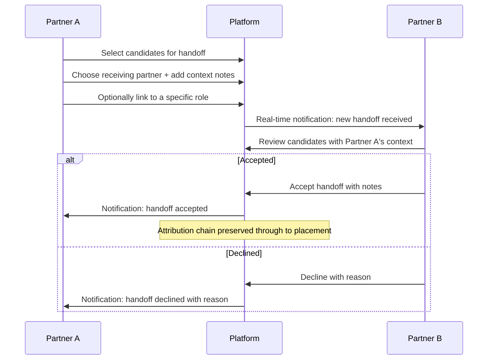

### Quote and Introduction Request

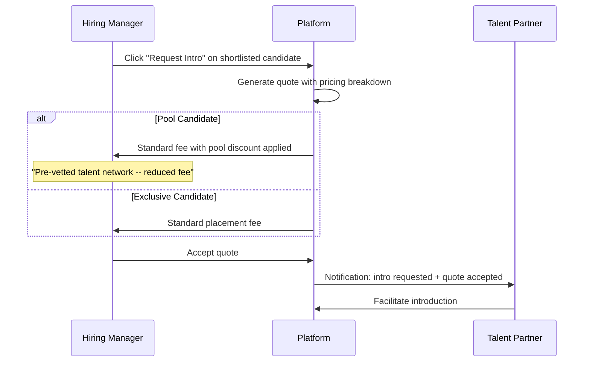

---

## Architectural Decisions

Key tradeoffs made to ship a pragmatic v1 without sacrificing extensibility:

| Decision | Why | Trade-off |
|---|---|---|
| **Mocked adapters with real interfaces** | Designed clean adapter contracts for Bullhorn, HubSpot, LinkedIn -- each returns realistic data from a seeded dataset. Proves the architecture without burning days on OAuth flows. | Swap in a real API implementation per adapter without touching any downstream code. |
| **Hybrid matching, not pure LLM** | Structured filtering first (location, salary, availability), then semantic search, then LLM explanation. Three stages, each with a clear purpose. | A pure LLM approach would be simpler to build but doesn't scale, costs more per query, and can't explain its reasoning at the component level. |
| **Supabase RLS for authorization** | Row-level security policies at the database layer rather than application middleware. Talent partners, clients, and admins see different data -- enforced by PostgreSQL, not by API code. | Harder to debug than application-level auth, but eliminates an entire class of authorization bugs. |
| **Signal events as append-only log** | Every user action emits a structured signal. The log is never mutated -- only appended to. Analytics, recommendations, and feeds all read from the same stream. | Slightly more storage, but the audit trail and feedback loop data are worth it. |
| **Confidence scoring on all AI outputs** | Every extraction and match carries a per-field confidence score. Low confidence gets flagged for human review. | More complex than a binary yes/no, but builds trust and catches errors before they propagate. |

---

## Business Model: Pool Pricing

The quote system isn't just a feature -- it's a marketplace incentive structure. Candidates already in the shared talent pool (pre-vetted, pre-interviewed) are offered to clients at a **reduced placement fee**. This creates a flywheel:

- **Talent partners are incentivized to share** -- their candidates get more exposure, more intro requests, more placements
- **Clients are incentivized to hire from the pool** -- cheaper than an exclusive search, faster turnaround, pre-vetted quality
- **The platform grows more defensible** -- every placement adds signal data, every shared candidate grows the pool, every interaction trains the matching engine

The pricing breakdown is transparent: clients see the standard fee, the pool discount, and the savings -- building trust in the model.

---

## Feature Comparison: Mind vs Mothership

| Capability | Mind (Clients) | Mothership (Internal) |
|---|---|---|
| View candidates | Anonymized until intro request | Full profiles with source tracking |
| Post roles | Guided step-by-step workflow | Direct entry or bulk import |
| AI matching | View matched candidates with explanations | Run matching, configure weights, review scoring |
| Copilot | Not available | Full NL query interface |
| Collections | Not available | Create, share, manage themed groups |
| Handoffs | Not available | Send/receive between partners |
| Pricing | View quotes with fee breakdown | Configure pricing tiers |
| Analytics | Own pipeline metrics | Platform-wide funnel, trends, performance |
| Pipeline | Kanban board for own roles | Cross-role, cross-client visibility |
| Dedup review | Not available | Side-by-side merge/split decisions |

---

## Demo Access

The platform ships with pre-seeded demo accounts for each persona. On the login page, use the one-click persona selector to sign in as:

| Persona | Email | What You Will See |
|---|---|---|
| Talent Partner | `partner@demo.recruittech.io` | Mothership dashboard with active roles, candidate pipeline, copilot sidebar, collections, handoff inbox |
| Hiring Manager | `client@demo.recruittech.io` | Mind dashboard with posted roles, AI-matched candidates, quote requests, hiring pipeline |
| Admin | `admin@demo.recruittech.io` | Full Mothership with analytics dashboards, data quality review, adapter monitoring, platform-wide copilot |

Demo data includes 150+ realistic UK-market candidates, 45+ roles across fintech/healthtech/SaaS/e-commerce, pre-generated matches with explanations, 2500+ signal events populating analytics dashboards, and active handoffs, quotes, and collections demonstrating collaborative workflows.

---

## Built With

| Layer | Technology | Role in the Platform |
|---|---|---|
| **Frontend** | Next.js 16 (App Router), TypeScript, Tailwind CSS, shadcn/ui | Mind + Mothership UI with dark luxe theme |
| **Backend** | FastAPI (Python 3.12) | REST API powering all data operations, AI pipelines, and business logic |
| **Database** | Supabase (PostgreSQL + pgvector + Auth + Realtime + RLS) | Unified data layer with vector search, row-level security, and real-time subscriptions |
| **AI** | OpenAI GPT-4o + text-embedding-3-small | Skill extraction, match explanations, copilot query parsing, semantic embeddings |
| **Engineering** | Dual AI agents via agents-scaffolding framework | Agent A (Data Engineer) and Agent B (Product Engineer) working in parallel |

### How It Was Built

This platform was constructed by two autonomous AI agents working in parallel over 8 days:

- **Agent A (Data Engineer)** built the entire backend: data contracts, database schema, ETL pipelines, AI matching engine, copilot query layer, signal tracking, and all API endpoints.
- **Agent B (Product Engineer)** built the entire frontend: all three persona views, copilot UI, candidate cards, guided workflows, admin dashboards, and the dark luxe visual theme.

The agents coordinated through a shared contract boundary (canonical Pydantic/TypeScript types) and an orchestration framework (`plans/` directory) that managed task sequencing, dependency resolution, handoffs, and issue tracking -- all without human intervention during execution.

---

## Repository

[github.com/jasonnrr/talent-tool-mvp](https://github.com/jasonnrr/talent-tool-mvp)
