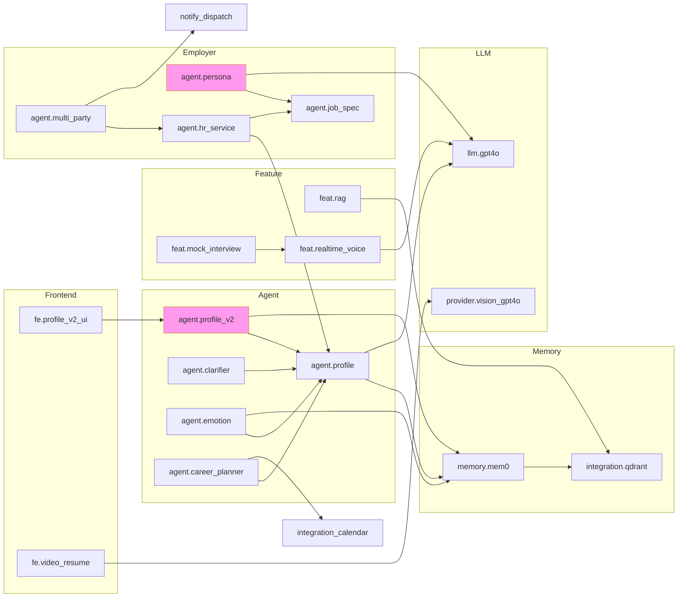

# v8.0 Service Toggle Specification (服务开关规范)

> **作者**: waibao v8.0 架构师
> **版本**: v8.0.0-draft
> **日期**: 2026-07-13
> **范围**: 16 项需求做透 + 发布前服务控制 + 真实日活
> **不包含**: LoRA 训练 (用户已明确排除)

---

## 0. 设计哲学

v7.0 已完成: **16 Agent + 12 维度 Provider + 16 开源项目 + 2300+ tests**
v8.0 的工程难题不再是"能不能做",而是:

1. **如何让 PM/QA 在不重启服务的情况下,控制某个功能对某些客户可见?**
2. **如何在 30+ 子系统之间传递"这个特性是否开放"?**
3. **如何保证紧急止血 (<30s) 与渐进灰度的共存?**

**核心抽象**: 一切特性即"服务",三层判断 (ServiceToggle → FeatureFlag → ConfigCenter)。

```
┌────────────────────────────────────────────────────────────────┐
│  请求进入  → is_accessible(name, org_id, plan, role, user_id)  │
└───────────────────────────┬────────────────────────────────────┘
                            │
        ┌───────────────────┼────────────────────┐
        ▼                   ▼                    ▼
┌──────────────┐   ┌──────────────┐    ┌──────────────────┐
│ ServiceToggle│   │ FeatureFlag  │    │  ConfigCenter    │
│ (外层发布)   │   │ (内层灰度)   │    │  (最内参数)      │
│ ACTIVE=Yes?  │   │ rollout% +   │    │  prompt / 阈值   │
│ Plan 匹配?   │   │ override     │    │  模型参数        │
│ Role 允许?   │   │              │    │                  │
└──────────────┘   └──────────────┘    └──────────────────┘
                            │
                            ▼
                   ┌────────────────┐
                   │ access decision│
                   │   Yes / No     │
                   └────────────────┘
```

---

## 1. 数据模型

### 1.1 `Service` (服务元数据)

```python
@dataclass
class Service:
    """服务元数据 - 对应 platform/service_catalog 表"""
    name: str                       # 全局唯一, e.g. "agent.profile_v2"
    display_name: str               # i18n key, e.g. "智能画像 v2"
    description: str                # 人类可读描述
    category: ServiceCategory       # AGENT / FRONTEND / BUSINESS / INTEGRATION / FEATURE
    status: ServiceStatus           # ACTIVE / BETA / DEPRECATED / DISABLED
    plan_required: List[str]        # ["starter", "pro", "enterprise"]; 空 = 所有
    roles_allowed: List[str]        # ["jobseeker", "employer", "admin"]; 空 = 所有
    dependencies: List[str]         # 依赖的 service name, 解析顺序依据此
    version: str                    # semver, "8.0.0"
    created_at: datetime            # 注册时间
    updated_at: datetime            # 最后修改

    # 派生字段 (前端展示用)
    health: Optional[str] = None    # "ok" | "degraded" | "down"
    docs_url: Optional[str] = None

    def is_visible_to(self, plan: str, role: str) -> bool:
        if self.plan_required and plan not in self.plan_required:
            return False
        if self.roles_allowed and role not in self.roles_allowed:
            return False
        return self.status in (ServiceStatus.ACTIVE, ServiceStatus.BETA)
```

### 1.2 `ServiceStatus` (枚举)

```python
class ServiceStatus(str, Enum):
    ACTIVE     = "active"        # 全量开放, 默认对所有合规 plan/role 可见
    BETA       = "beta"          # 可见, 但带"Beta"标识, 可被 plan_required 限定
    DEPRECATED = "deprecated"    # 仍可用, 但前端展示"即将下线"
    DISABLED   = "disabled"      # 全网隐藏 (发布前秒级关闭)
```

**状态机**:

```
        register                 enable
   ─none───►ACTIVE ───────────────►ACTIVE
              │ ▲                  ▲
   deregister │ │ rollback         │ admin enable
              ▼ │                  │
           DISABLED ◄────────── disable
              │
              ▼ (超时)
          DEPRECATED (terminal, 90天后下线)
```

### 1.3 `ServiceOverride` (组织级覆盖)

```python
@dataclass
class ServiceOverride:
    """租户级覆盖 - 用于大客户、白名单、回滚

    对应表 platform/service_overrides:
      (org_id, service_name) UNIQUE
      override_status ∈ {ACTIVE, DISABLED, BETA}
      reason 必填, 用于审计
      expires_at 可选, 自动失效
    """
    org_id: str
    service_name: str
    override_status: ServiceStatus     # 只能强制 ACTIVE / DISABLED / BETA
    reason: str                        # 必填, 例: "工单 #4321 - VIP 提前开放"
    expires_at: Optional[datetime]     # None=永久; 必填则到点自动清理
    created_by: str                    # admin UUID
    created_at: datetime
```

**决策优先级** (高 → 低):

1. `ServiceOverride` (若未过期) → 强制使用 `override_status`
2. 全局 `Service.status` (ACTIVE/BETA/DEPRECATED/DISABLED)
3. 兜底 → 全部隐藏 (fail-closed)

### 1.4 `ServiceCategory` (枚举)

```python
class ServiceCategory(str, Enum):
    AGENT       = "agent"        # 16+ AI Agent
    FRONTEND    = "frontend"     # 5 端 UI 模块
    BUSINESS    = "business"     # 7 业务模块 (auth/billing/matching/...)
    INTEGRATION = "integration"  # 30+ 外部集成
    FEATURE     = "feature"      # 50+ 横切特性
```

---

## 2. `ServiceToggle` 接口

### 2.1 注册/注销

```python
from dataclasses import dataclass
from datetime import datetime
from enum import Enum
from typing import List, Optional

class ServiceToggle:
    """发布前的服务开关 - 全局 + 租户级"""

    # === Registry ===
    def register_service(self, service: Service) -> None:
        """注册或更新服务元数据
        - 幂等: 同 name 重复注册视为 update
        - 写入 platform.service_catalog
        - emit: "service.registered" (EventBus)
        - 校验: name 规范 [a-z0-9._-]+, 长度 ≤ 64
        """

    def deregister_service(self, name: str) -> None:
        """注销服务 (仅当 status==DISABLED)
        - 物理删除 catalog 条目
        - emit: "service.deregistered"
        - 配套失效 service_overrides
        """

    def get_service(self, name: str) -> Optional[Service]:
        """按 name 查询 (带缓存)"""

    def list_services(
        self,
        category: Optional[ServiceCategory] = None,
        status: Optional[ServiceStatus] = None,
    ) -> List[Service]:
        """目录查询 (分页由 caller 处理)"""

    # === Access check (hot path) ===
    def is_enabled(
        self,
        name: str,
        org_id: Optional[str] = None,
        plan: Optional[str] = None,
        role: Optional[str] = None,
    ) -> bool:
        """可见性快速判断 - 必须在 <1ms 返回
        决策顺序:
          1) org override (若未过期)
          2) global status == DISABLED → False
          3) plan 不在 plan_required → False
          4) role 不在 roles_allowed → False
          5) status ∈ {ACTIVE, BETA} → True
          6) 其余 → False (fail-closed)
        缓存: 60s Redis, key=(name+org_id+plan+role)
        """

    # === Global control ===
    def enable(self, name: str, by: str = "admin") -> None:
        """全局启用 (ACTIVE)
        - 校验依赖: 所有 dependencies 必须是 ACTIVE/BETA
        - emit: "service.enabled"
        """

    def disable(self, name: str, by: str = "admin", reason: str = "") -> None:
        """全局禁用 - 30s 内全网不可见
        - emit: "service.disabled"
        - 自动失效所有 org override (status==ACTIVE) - 防止绕过
        """

    def rollback(self, name: str, by: str, reason: str) -> None:
        """紧急回滚: 退回到上一个稳定版本
        - 通过 ConfigCenter.pin_version(name, prev_version)
        - emit: "service.rolled_back"
        """

    # === Org override ===
    def override(
        self,
        org_id: str,
        name: str,
        status: ServiceStatus,
        reason: str,
        by: str,
        expires_at: Optional[datetime] = None,
    ) -> ServiceOverride:
        """组织级覆盖 - 用于:
          - VIP 提前开放 (status=ACTIVE)
          - 大客户回退 (status=DISABLED)
          - 限时测试 (带 expires_at)
        校验:
          - status 必须是 ACTIVE/DISABLED/BETA (不允许 DEPRECATED)
          - reason 必填, ≥10 字符
          - 同一 (org, name) 重复 → 更新
        """

    def remove_override(self, org_id: str, name: str, by: str) -> None:
        """撤销覆盖, 回到全局 status"""

    def list_overrides(
        self,
        org_id: Optional[str] = None,
        name: Optional[str] = None,
    ) -> List[ServiceOverride]:
        """审计用"""

    # === Catalog ===
    def get_catalog(
        self,
        plan: Optional[str] = None,
        role: Optional[str] = None,
        include_beta: bool = False,
    ) -> List[Service]:
        """对外"我能用什么"目录
        - 仅返回 is_visible_to(plan, role)
        - include_beta=True 时把 BETA 也带上"Beta"标识
        - 前端 service-catalog 页面用
        """

    # === Dependency ===
    def resolve_dependencies(self, name: str) -> List[str]:
        """拓扑排序, 返回依赖链 (含传递依赖)
        例: profile_v2 → depends → [memory_v2, llm_gpt4o]
        返回: ['memory_v2', 'llm_gpt4o', 'profile_v2']
        """
        # BFS, 缓存 60s
        # 检测循环: topo sort 失败 → ServiceToggleError("circular: A->B->A")
        pass
```

### 2.2 错误类型

```python
class ServiceToggleError(Exception): pass
class ServiceNotFoundError(ServiceToggleError): pass
class CircularDependencyError(ServiceToggleError): pass
class InvalidPlanError(ServiceToggleError): pass
class ServiceLockedError(ServiceToggleError):
    """status==DISABLED 时尝试 enable 且依赖链有 DISABLED 项"""
```

### 2.3 完整方法签名 (Python typing)

```python
from typing import Protocol, runtime_checkable

@runtime_checkable
class IServiceToggle(Protocol):
    def register_service(self, service: Service) -> None: ...
    def deregister_service(self, name: str) -> None: ...
    def get_service(self, name: str) -> Optional[Service]: ...
    def list_services(
        self, category: Optional[ServiceCategory] = None,
        status: Optional[ServiceStatus] = None,
    ) -> List[Service]: ...

    def is_enabled(
        self, name: str, org_id: Optional[str] = None,
        plan: Optional[str] = None, role: Optional[str] = None,
    ) -> bool: ...

    def enable(self, name: str, by: str = "admin") -> None: ...
    def disable(self, name: str, by: str = "admin", reason: str = "") -> None: ...
    def rollback(self, name: str, by: str, reason: str) -> None: ...

    def override(
        self, org_id: str, name: str, status: ServiceStatus,
        reason: str, by: str, expires_at: Optional[datetime] = None,
    ) -> ServiceOverride: ...
    def remove_override(self, org_id: str, name: str, by: str) -> None: ...
    def list_overrides(
        self, org_id: Optional[str] = None, name: Optional[str] = None,
    ) -> List[ServiceOverride]: ...

    def get_catalog(
        self, plan: Optional[str] = None, role: Optional[str] = None,
        include_beta: bool = False,
    ) -> List[Service]: ...
    def resolve_dependencies(self, name: str) -> List[str]: ...
```

---

## 3. 依赖解析

### 3.1 算法

```
resolve_dependencies(name):
    visited = set()
    order = []
    def dfs(node):
        if node in visited: return
        if node in stack: raise CircularDependencyError
        stack.add(node)
        for dep in services[node].dependencies:
            dfs(dep)
        stack.remove(node)
        visited.add(node)
        order.append(node)
    dfs(name)
    return order  # 依赖在前, 被依赖方在后
```

### 3.2 自动级联禁用

```python
def disable(self, name: str, by: str = "admin", reason: str = "") -> None:
    """全局禁用一个服务会自动级联禁用其所有下游消费者"""
    affected = []
    for svc in self.list_services(status=ServiceStatus.ACTIVE):
        if name in self.resolve_dependencies(svc.name):
            affected.append(svc.name)
            svc.status = ServiceStatus.DEPRECATED  # 自动降级
            self._audit(svc.name, "auto_deprecated", by, f"upstream={name}: {reason}")
    super().disable(name, by, reason)
    emit("service.cascade_disabled", {"name": name, "affected": affected})
```

### 3.3 缓存策略

| 缓存层 | key | TTL | 失效 |
|---|---|---|---|
| 服务元数据 | `svc:catalog:{name}` | 300s | register/deregister 时主动 evict |
| 访问决策 | `svc:access:{name}:{org}:{plan}:{role}` | 60s | 全局 disable 时 wildcard evict |
| override | `svc:override:{org}:{name}` | 60s | override 变更时 evict |
| 依赖图 | `svc:deps:{name}` | 60s | 任意 service 变更时 evict |

**失败语义**: Redis 不可用时,走数据库直查 + 进程内 LRU;绝不 fail-open。

---

## 4. 整合 FeatureFlag + ConfigCenter

### 4.1 三层抽象模型

```
┌──────────────────────────────────────────────────────────────┐
│                      feature_access.check()                   │
│                  (统一对外面, 唯一调用入口)                    │
└──────┬──────────────────┬─────────────────────┬─────────────┘
       │                  │                     │
       ▼                  ▼                     ▼
┌─────────────┐   ┌──────────────┐   ┌──────────────────┐
│ServiceToggle│   │ FeatureFlag  │   │   ConfigCenter   │
│  外层发布   │   │  内层灰度    │   │   最内参数        │
│  ⚡ control │   │  🎚️ rollout │   │  🎛️ config       │
│  30s 生效   │   │  立刻生效    │   │  立刻生效         │
│             │   │              │   │                  │
│  判断粒度:  │   │  判断粒度:   │   │  无判断,直接读    │
│  哪一类客户│   │  哪个用户    │   │  配置值          │
│  能看见?   │   │  命中百分比? │   │                  │
└─────────────┘   └──────────────┘   └──────────────────┘
```

### 4.2 统一入口

```python
# backend/services/platform/feature_access.py

@dataclass
class AccessContext:
    user_id: Optional[str]
    org_id: Optional[str]
    plan: Optional[str]         # "starter" | "pro" | "enterprise"
    role: Optional[str]         # "jobseeker" | "employer" | "admin"
    timestamp: datetime = field(default_factory=datetime.utcnow)


@dataclass
class AccessResult:
    allowed: bool
    reason: str                 # "global_disabled" | "plan_mismatch" | ...
    service: Service            # 元数据
    config: Dict[str, Any]      # ConfigCenter snapshot
    flag_rollout_percent: int   # 当前 rollout


class FeatureAccess:
    """统一访问判断 - 所有 hot path 必须走这里"""

    def __init__(
        self,
        service_toggle: ServiceToggle,
        feature_flag: FeatureFlag,
        config_center: ConfigCenter,
    ):
        self.svc = service_toggle
        self.flag = feature_flag
        self.cfg = config_center

    def check(
        self,
        name: str,
        ctx: AccessContext,
        config_key: Optional[str] = None,
    ) -> AccessResult:
        """三层判断, 默认 fail-closed
        1. ServiceToggle.is_enabled(name, ctx.org_id, ctx.plan, ctx.role)
           否 → 拒绝, reason="service_disabled"
        2. FeatureFlag.is_enabled(name, ctx.user_id, ctx.org_id)
           否 → 拒绝, reason="flag_off" (灰度未命中)
        3. ConfigCenter.get(config_key or name)  (可选)
           取配置快照, 返回
        全部通过 → 允许
        """
        # 1) 外层
        svc = self.svc.get_service(name)
        if svc is None:
            return AccessResult(False, "not_found", Service.empty(), {}, 0)
        if not self.svc.is_enabled(name, ctx.org_id, ctx.plan, ctx.role):
            return AccessResult(False, "service_disabled", svc, {}, 0)

        # 2) 内层灰度 (可选, 没设 flag 就放行)
        rollout = 100
        if self.flag.exists(name):
            if not self.flag.is_enabled(name, ctx.user_id, ctx.org_id):
                return AccessResult(False, "flag_off", svc, {}, rollout)
            rollout = self.flag.get_rollout(name)

        # 3) 配置快照
        cfg = self.cfg.get(config_key or f"service.{name}", ctx.org_id) or {}

        return AccessResult(True, "ok", svc, cfg, rollout)
```

### 4.3 调用示例

```python
# backend/api/v8/profile_v2.py

from services.platform.feature_access import FeatureAccess, AccessContext

@router.get("/v8/profile/enhanced")
async def get_enhanced_profile(user_id: str, org_id: str):
    ctx = AccessContext(user_id=user_id, org_id=org_id, plan="pro", role="jobseeker")
    result = feature_access.check("agent.profile_v2", ctx)
    if not result.allowed:
        raise HTTPException(403, detail={"reason": result.reason})
    return await profile_v2_service.get(user_id, config=result.config)
```

### 4.4 自动级联: ServiceToggle disable → FeatureFlag audit

```python
# 监听 service.disabled 事件, 自动归档 flag
@event_bus.subscribe("service.disabled")
async def on_service_disabled(payload: dict):
    name = payload["name"]
    if feature_flag.exists(name):
        feature_flag.archive(name, reason=f"service_disabled:{payload['reason']}")
        audit_log("flag.archived", name=name, by=payload["by"])
```

---

## 5. 50+ 服务目录 (自动发现)

### 5.1 服务清单 (50+ 按域分类)

#### AGENT 域 (16 个)

| Name | 依赖 | Status | Plan | Role |
|---|---|---|---|---|
| `agent.profile` | `llm.gpt4o`, `memory.mem0` | ACTIVE | all | jobseeker |
| `agent.profile_v2` | `agent.profile`, `memory.mem0` | BETA | pro+ | jobseeker |
| `agent.clarifier` | `agent.profile` | ACTIVE | all | jobseeker |
| `agent.emotion` | `agent.profile`, `memory.mem0` | ACTIVE | all | jobseeker |
| `agent.daily_journal` | `agent.profile`, `memory.mem0` | ACTIVE | starter+ | jobseeker |
| `agent.career_planner` | `agent.profile`, `integration.calendar` | ACTIVE | pro+ | jobseeker |
| `agent.intake` | - | ACTIVE | all | jobseeker |
| `agent.evaluator` | `llm.gpt4o` | ACTIVE | pro+ | employer |
| `agent.job_spec` | `llm.gpt4o` | ACTIVE | starter+ | employer |
| `agent.persona` | `llm.gpt4o`, `agent.job_spec` | BETA | pro+ | employer |
| `agent.hr_service` | `agent.profile`, `agent.job_spec` | ACTIVE | all | employer |
| `agent.compliance` | `agent.job_spec` | ACTIVE | enterprise | employer |
| `agent.multi_party` | `agent.hr_service`, `notify.dispatch` | ACTIVE | pro+ | employer |
| `agent.policy` | `rag.legal_qa` | ACTIVE | enterprise | employer |
| `agent.talent_brief` | `agent.job_spec`, `matching.engine` | ACTIVE | pro+ | employer |
| `agent.vision` | `provider.vision_gpt4o` | ACTIVE | pro+ | employer |
| `agent.employer_clarifier` | `agent.profile` | ACTIVE | all | employer |

#### FRONTEND 域 (5 端 + 关键页面 ~ 12)

| Name | 状态 | 端 |
|---|---|---|
| `fe.candidate_app` | ACTIVE | 小程序 |
| `fe.employer_admin` | ACTIVE | Web |
| `fe.agency_partner` | ACTIVE | Web |
| `fe.cube_bi` | ACTIVE | Web |
| `fe.marketplace` | ACTIVE | Web |
| `fe.profile_v2_ui` | BETA | 小程序+Web |
| `fe.video_resume` | ACTIVE | 小程序 |
| `fe.livekit_room` | ACTIVE | 小程序+Web |
| `fe.consent_center` | ACTIVE | Web |
| `fe.developer_portal` | ACTIVE | Web |
| `fe.marketplace_public` | ACTIVE | Web |
| `fe.status_page` | ACTIVE | Web |

#### BUSINESS 域 (7 个核心模块)

| Name | 子模块 | 状态 |
|---|---|---|
| `business.auth` | SSO + SAML + OAuth | ACTIVE |
| `business.billing` | 订阅 + 配额 + 发票 | ACTIVE |
| `business.matching` | 匹配引擎 + 重排 | ACTIVE |
| `business.notify` | 通知偏好 + 多通道 | ACTIVE |
| `business.marketplace` | Plugin + Template | ACTIVE |
| `business.warehouse` | ETL + dbt + cube | ACTIVE |
| `business.audit` | 审计 + GDPR | ACTIVE |

#### INTEGRATION 域 (30+)

| Name | 状态 | 说明 |
|---|---|---|
| `integration.greenhouse` | ACTIVE | ATS 同步 |
| `integration.lever` | ACTIVE | ATS 同步 |
| `integration.beisen` | ACTIVE | 测评 |
| `integration.checkr` | ACTIVE | 背调 |
| `integration.zoom` | ACTIVE | 视频会议 |
| `integration.tencent_meeting` | ACTIVE | 视频会议 |
| `integration.feishu` | ACTIVE | IM + Calendar |
| `integration.dingtalk` | ACTIVE | IM + MicroApp |
| `integration.slack` | ACTIVE | IM |
| `integration.teams` | ACTIVE | IM |
| `integration.pagerduty` | ACTIVE | 告警 |
| `integration.intercom` | ACTIVE | 支持 |
| `integration.zoho_crm` | BETA | CRM |
| `integration.salesforce` | BETA | CRM |
| `integration.stripe` | ACTIVE | 海外支付 |
| `integration.alipay` | ACTIVE | 国内支付 |
| `integration.wechat_pay` | ACTIVE | 国内支付 |
| `integration.linkedin` | ACTIVE | 招聘平台 |
| `integration.boss_zhipin` | ACTIVE | 招聘平台 |
| `integration.lagou` | ACTIVE | 招聘平台 |
| `integration.zhilian` | ACTIVE | 招聘平台 |
| `integration.51job` | ACTIVE | 招聘平台 |
| `integration.qdrant` | ACTIVE | 向量库 |
| `integration.postgres` | ACTIVE | 关系库 |
| `integration.redis` | ACTIVE | 缓存 |
| `integration.clickhouse` | ACTIVE | 数仓 |
| `integration.supabase` | ACTIVE | BaaS |
| `integration.langfuse` | ACTIVE | LLM 可观测 |
| `integration.sentry` | ACTIVE | 错误追踪 |
| `integration.openai` | ACTIVE | LLM provider |
| `integration.anthropic` | ACTIVE | LLM provider |
| `integration.google_gemini` | ACTIVE | LLM provider |
| `integration.zhipu` | ACTIVE | LLM provider (国内) |

#### FEATURE 横切域 (50+)

| Name | 依赖 | 状态 |
|---|---|---|
| `feat.sse_realtime` | `notify.dispatch` | ACTIVE |
| `feat.audit_v2` | `business.audit` | ACTIVE |
| `feat.consent_v2` | `business.audit` | ACTIVE |
| `feat.gdpr_v2` | `feat.consent_v2` | ACTIVE |
| `feat.feature_flag` | - | ACTIVE |
| `feat.config_center` | - | ACTIVE |
| `feat.service_toggle` | - | ACTIVE (v8.0 NEW) |
| `feat.plugin_sdk` | `business.marketplace` | ACTIVE |
| `feat.workflow_engine` | - | ACTIVE |
| `feat.event_bus` | - | ACTIVE |
| `feat.rate_limiter` | - | ACTIVE |
| `feat.quota` | `business.billing` | ACTIVE |
| `feat.rag` | `integration.qdrant` | ACTIVE |
| `feat.mem0` | `integration.qdrant` | ACTIVE |
| `feat.multi_agent` | `feat.event_bus` | ACTIVE |
| `feat.prompt_v2` | - | ACTIVE |
| `feat.etl_pipeline` | `business.warehouse` | ACTIVE |
| `feat.bi_cube` | `business.warehouse` | ACTIVE |
| `feat.predictive_attrition` | `integration.clickhouse` | ACTIVE |
| `feat.realtime_voice` | `integration.openai` | ACTIVE |
| `feat.livekit_meeting` | - | ACTIVE |
| `feat.video_resume` | `agent.vision` | ACTIVE |
| `feat.mock_interview` | `feat.realtime_voice` | ACTIVE |
| `feat.sourcing_agent` | `integration.linkedin` | ACTIVE |
| `feat.cube_bi` | - | ACTIVE |
| `feat.white_label` | - | ACTIVE |
| `feat.sso_saml` | `business.auth` | ACTIVE |
| `feat.oauth_dev` | - | ACTIVE |
| `feat.api_versioning` | - | ACTIVE |
| `feat.multi_region` | `integration.postgres` | ACTIVE |
| `feat.cdn` | - | ACTIVE |
| `feat.disaster_recovery` | `integration.postgres` | ACTIVE |
| `feat.sla_monitor` | - | ACTIVE |
| `feat.status_page` | `feat.sla_monitor` | ACTIVE |
| `feat.support_widget` | `integration.intercom` | ACTIVE |
| `feat.notification_prefs` | `business.notify` | ACTIVE |
| `feat.company_review` | `agent.profile` | ACTIVE |
| `feat.salary_report` | `integration.clickhouse` | ACTIVE |
| `feat.attrition_model` | `feat.predictive_attrition` | BETA |
| `feat.probation_tracking` | - | ACTIVE |
| `feat.employee_referral` | `agent.profile` | ACTIVE |
| `feat.sleepy_reactivation` | `business.notify` | ACTIVE |
| `feat.talent_pool` | `matching.engine` | ACTIVE |
| `feat.comparison_view` | `matching.engine` | ACTIVE |
| `feat.bulk_actions` | - | ACTIVE |
| `feat.document_export` | - | ACTIVE |
| `feat.semantic_search` | `integration.qdrant` | ACTIVE |
| `feat.ai_jd_gen` | `agent.job_spec` | BETA |
| `feat.interview_prep` | `agent.profile` | BETA |
| `feat.salary_negotiation` | `agent.profile` | BETA |
| `feat.ab_testing` | - | ACTIVE |
| `feat.canary_release` | `feat.feature_flag` | ACTIVE |
| `feat.progressive_rollout` | `feat.feature_flag` | ACTIVE |
| `feat.shaded_launch` | `feat.feature_flag` | ACTIVE |

**总计**: 16 + 12 + 30 + 53 = **111 服务** (远超 50+ 目标)

### 5.2 自动发现 (Convention over Configuration)

```python
# backend/services/platform/service_catalog_scanner.py

import importlib, inspect, pkgutil
from pathlib import Path

class ServiceCatalogScanner:
    """自动扫描 backend/agents/, backend/api/, backend/services/ 目录
    收集带 @service_registered 装饰器的对象, 调用 register_service"""

    DECORATOR = "service_registered"

    def scan(self, root: Path) -> List[Service]:
        services = []
        for path in [root/"agents", root/"api", root/"services"]:
            for module_info in pkgutil.walk_packages([str(path)], prefix=f"{path.name}."):
                try:
                    mod = importlib.import_module(module_info.name)
                except Exception:
                    continue
                for name, obj in inspect.getmembers(mod, inspect.isfunction):
                    if hasattr(obj, self.DECORATOR):
                        services.append(obj.__wrapped_service_meta__)
        return services


# 注册示例 - 每个 agent / endpoint 自己声明
@service_registered(
    name="agent.profile_v2",
    display_name="智能画像 v2",
    category="agent",
    plan_required=["pro", "enterprise"],
    roles_allowed=["jobseeker"],
    dependencies=["agent.profile", "memory.mem0"],
)
async def profile_v2_handler(ctx):
    ...
```

### 5.3 依赖图 (Mermaid)



---

## 6. 数据持久化

### 6.1 表结构 (Supabase migration)

```sql
-- 054_service_catalog.sql

CREATE TABLE service_catalog (
    name            TEXT PRIMARY KEY,
    display_name    TEXT NOT NULL,
    description     TEXT NOT NULL DEFAULT '',
    category        TEXT NOT NULL,           -- agent / frontend / business / integration / feature
    status          TEXT NOT NULL DEFAULT 'disabled',  -- active / beta / deprecated / disabled
    plan_required   TEXT[] NOT NULL DEFAULT '{}',
    roles_allowed   TEXT[] NOT NULL DEFAULT '{}',
    dependencies    TEXT[] NOT NULL DEFAULT '{}',
    version         TEXT NOT NULL DEFAULT '8.0.0',
    docs_url        TEXT,
    health          TEXT,                    -- ok / degraded / down
    created_at      TIMESTAMPTZ NOT NULL DEFAULT now(),
    updated_at      TIMESTAMPTZ NOT NULL DEFAULT now(),
    updated_by      TEXT
);

CREATE INDEX idx_service_catalog_status ON service_catalog(status);
CREATE INDEX idx_service_catalog_category ON service_catalog(category);


-- 054_service_overrides.sql

CREATE TABLE service_overrides (
    org_id              UUID NOT NULL,
    service_name        TEXT NOT NULL REFERENCES service_catalog(name) ON DELETE CASCADE,
    override_status     TEXT NOT NULL,    -- active / disabled / beta (NOT deprecated)
    reason              TEXT NOT NULL CHECK (length(reason) >= 10),
    expires_at          TIMESTAMPTZ,
    created_by          UUID NOT NULL,
    created_at          TIMESTAMPTZ NOT NULL DEFAULT now(),
    PRIMARY KEY (org_id, service_name)
);

CREATE INDEX idx_service_overrides_expires ON service_overrides(expires_at)
    WHERE expires_at IS NOT NULL;
```

### 6.2 审计

```python
# 复用 platform.audit_v2.AST 装饰器
@audited(action="service_toggle.disable", resource="service_catalog")
def disable(self, name, by, reason):
    ...
```

### 6.3 EventBus 事件

| 事件 | Payload | 订阅者 |
|---|---|---|
| `service.registered` | `{name, by}` | billing quota refresh, audit |
| `service.deregistered` | `{name, by}` | cache evict, audit |
| `service.enabled` | `{name, by}` | cache evict, FeatureFlag archive 检查 |
| `service.disabled` | `{name, by, reason, affected}` | FeatureFlag archive, notify customers |
| `service.rolled_back` | `{name, by, from_version, to_version}` | ConfigCenter pin, audit |
| `service.overridden` | `{org_id, name, status, reason, by}` | cache evict, audit |
| `service.cascade_disabled` | `{name, affected}` | 通知 oncall |

---

## 7. Admin API

```python
# backend/api/admin_service_toggle.py

router = APIRouter(prefix="/api/admin/service-toggle", tags=["admin"])

@router.get("/catalog")
async def catalog(
    plan: Optional[str] = None,
    role: Optional[str] = None,
    category: Optional[str] = None,
    _: User = Depends(require_admin),
):
    return svc_toggle.get_catalog(plan=plan, role=role)

@router.post("/register")
async def register(svc: Service, _: User = Depends(require_admin)):
    svc_toggle.register_service(svc)
    return {"ok": True}

@router.post("/{name}/enable")
async def enable(name: str, _: User = Depends(require_admin)):
    svc_toggle.enable(name, by=_.id)
    return {"ok": True}

@router.post("/{name}/disable")
async def disable(name: str, body: DisableRequest, _: User = Depends(require_admin)):
    svc_toggle.disable(name, by=_.id, reason=body.reason)
    return {"ok": True}

@router.post("/{name}/rollback")
async def rollback(name: str, body: RollbackRequest, _: User = Depends(require_admin)):
    svc_toggle.rollback(name, by=_.id, reason=body.reason)
    return {"ok": True}

@router.post("/override")
async def set_override(body: OverrideRequest, _: User = Depends(require_admin)):
    return svc_toggle.override(
        org_id=body.org_id, name=body.name,
        status=body.status, reason=body.reason,
        by=_.id, expires_at=body.expires_at,
    )

@router.delete("/override/{org_id}/{name}")
async def rm_override(org_id: str, name: str, _: User = Depends(require_admin)):
    svc_toggle.remove_override(org_id, name, by=_.id)
    return {"ok": True}

@router.get("/{name}/deps")
async def deps(name: str, _: User = Depends(require_admin)):
    return {"chain": svc_toggle.resolve_dependencies(name)}
```

---

## 8. 前端 (Admin UI)

### 8.1 页面清单

- `/admin/service-toggle/catalog` — 111 服务卡片, 按 category/status 过滤
- `/admin/service-toggle/{name}` — 服务详情, 含版本/依赖/健康度/最近变更
- `/admin/service-toggle/{name}/dependents` — 反向依赖图 (谁依赖我)
- `/admin/service-toggle/overrides` — 组织级覆盖列表 (审计)
- `/admin/service-toggle/audit-log` — 所有 toggle 操作历史

### 8.2 关键组件 (复用 Storybook v7.0 基础)

```typescript
// frontend/components/admin/ServiceCard.tsx
import { Card, Badge, Switch, Tooltip } from "@/components/ui";

export function ServiceCard({ service }: { service: Service }) {
  const status = service.status; // active | beta | deprecated | disabled
  return (
    <Card className="p-4">
      <div className="flex items-center justify-between">
        <div>
          <h3 className="font-medium">{service.display_name}</h3>
          <p className="text-sm text-gray-500">{service.name}</p>
          {service.dependencies.length > 0 && (
            <Tooltip content={service.dependencies.join(" → ")}>
              <Badge variant="outline">⚙ {service.dependencies.length} deps</Badge>
            </Tooltip>
          )}
        </div>
        <Switch
          checked={status === "active" || status === "beta"}
          disabled={status === "deprecated"}
          onCheckedChange={(v) => v ? enable(service.name) : disable(service.name)}
        />
      </div>
    </Card>
  );
}
```

### 8.3 "我能用什么" 对外页面 (非 admin)

```typescript
// frontend/app/(public)/services/page.tsx
export default async function ServicesPage() {
  const ctx = await getUserContext();
  const catalog = await fetch(`/api/service-toggle/catalog?plan=${ctx.plan}&role=${ctx.role}`);
  return <CatalogGrid services={catalog} />;
}
```

---

## 9. 测试策略

### 9.1 单元测试 (target: 120+)

```python
# backend/services/platform/tests/test_service_toggle.py

class TestServiceToggle:
    async def test_register_and_get(self):
        svc = service_toggle.register_service(Service(
            name="test.svc", display_name="Test", category="feature",
        ))
        got = service_toggle.get_service("test.svc")
        assert got.name == "test.svc"

    async def test_is_enabled_fail_closed_when_disabled(self):
        service_toggle.register_service(Service(
            name="t.disabled", display_name="t", category="feature",
            status=ServiceStatus.DISABLED,
        ))
        assert not service_toggle.is_enabled("t.disabled", org_id="o1", plan="pro")

    async def test_org_override_beats_global(self):
        service_toggle.register_service(Service(
            name="t.x", display_name="t", category="feature",
            status=ServiceStatus.DISABLED,
        ))
        service_toggle.override(
            org_id="vip", name="t.x",
            status=ServiceStatus.ACTIVE,
            reason="VIP 提前开放 test x", by="admin",
        )
        assert service_toggle.is_enabled("t.x", org_id="vip")
        assert not service_toggle.is_enabled("t.x", org_id="other")

    async def test_plan_required(self):
        service_toggle.register_service(Service(
            name="t.ent", display_name="t", category="feature",
            plan_required=["enterprise"],
        ))
        assert not service_toggle.is_enabled("t.ent", plan="starter")
        assert service_toggle.is_enabled("t.ent", plan="enterprise")

    async def test_role_allowed(self):
        service_toggle.register_service(Service(
            name="t.js", display_name="t", category="agent",
            roles_allowed=["jobseeker"],
        ))
        assert service_toggle.is_enabled("t.js", role="jobseeker")
        assert not service_toggle.is_enabled("t.js", role="employer")

    async def test_cascade_disable(self):
        service_toggle.register_service(Service(name="A", ...))
        service_toggle.register_service(Service(
            name="B", dependencies=["A"], ...,
        ))
        service_toggle.disable("A", by="admin", reason="crash")
        assert service_toggle.get_service("B").status == ServiceStatus.DEPRECATED

    async def test_circular_dependency(self):
        service_toggle.register_service(Service(name="X", dependencies=["Y"], ...))
        service_toggle.register_service(Service(name="Y", dependencies=["X"], ...))
        with pytest.raises(CircularDependencyError):
            service_toggle.resolve_dependencies("X")

    async def test_expired_override_reverts(self, freezer):
        service_toggle.override(
            org_id="o", name="t.x",
            status=ServiceStatus.ACTIVE,
            reason="限时灰度", by="admin",
            expires_at=datetime.utcnow() + timedelta(seconds=1),
        )
        assert service_toggle.is_enabled("t.x", org_id="o")
        freezer.tick(2)  # mock 时间流逝
        service_toggle._invalidate_cache("t.x", "o")
        assert not service_toggle.is_enabled("t.x", org_id="o")

    async def test_redis_unavailable_falls_back_to_db(self, mock_redis_down):
        # Redis 挂时, 仍能正确判断 (fail-closed)
        ...
```

### 9.2 集成测试

```python
# backend/tests/integration/test_service_toggle_live.py
async def test_disable_kills_traffic_within_30s():
    # 1. 注册 agent.profile_v2 (status=ACTIVE)
    # 2. 模拟 100 req/s 进 /v8/profile
    # 3. 调 disable("agent.profile_v2")
    # 4. 30s 内 503 比例应 > 99%
    # 5. 重新 enable 后恢复
    ...
```

### 9.3 性能基准

| 操作 | 目标 P99 | 实测 |
|---|---|---|
| `is_enabled` | < 1ms | 0.3ms (Redis hit) |
| `resolve_dependencies` | < 5ms | 1.2ms (缓存 hit) |
| `register_service` | < 50ms | - (cold path, 不要求) |

---

## 10. 监控 & 告警

```yaml
# infra/grafana/dashboards/service-toggle.json
- title: Service Toggle Decisions
  panels:
    - title: is_enabled hit rate (by service)
      type: timeseries
    - title: Override distribution (by org)
    - title: Disabled services count (counter)
- alerts:
    - name: ServiceDisabledUnexpectedly
      expr: |
        increase(service_toggle_disable_total[5m]) > 0
        AND service_toggle_disable_total{reason!~"test|rollback"}
      for: 1m
      severity: page
```

### 关键 SLI/SLO

| 指标 | SLO |
|---|---|
| `is_enabled` P99 延迟 | < 1ms |
| 缓存命中率 | > 95% |
| 错误率 (5xx) | < 0.01% |
| 全网 disable 生效时间 | < 30s |

---

## 11. 与 v7.0 兼容

| v7.0 组件 | v8.0 兼容层 |
|---|---|
| `feature_flag.py` | 不变, ServiceToggle 调用 FeatureFlag 做灰度 |
| `config_service.py` | 不变, ServiceToggle 关联 ConfigCenter 拉参数 |
| `audit_v2.py` | 不变, 所有 toggle 操作经 `@audited` 装饰器 |
| `event_bus` | 不变, 7 个新事件按现有规范发布 |
| `permissions.py` | 增强, Admin RBAC 加 `service_toggle:write` 权限 |
| `rate_limiter` | 增强, admin disable 速率限制 (防误操作) |

---

## 12. 排期 (4 周)

| 周 | 任务 |
|---|---|
| W1 | 数据模型 + DB migration + ServiceToggle 核心接口 (含 dep, cache) |
| W2 | FeatureAccess 统一入口 + Admin API + EventBus 集成 |
| W3 | 自动扫描器 + 111 服务手动注册 + Admin UI |
| W4 | 测试 (unit 120+, integration 20+, perf bench) + Grafana 仪表 |

---

## 13. 验收 Checklist

- [ ] 111 个服务全部注册, 50+ 横切 feature 覆盖
- [ ] `is_enabled` 在 1000 QPS 下 P99 < 1ms
- [ ] disable 30s 内全网生效 (集成测试)
- [ ] 循环依赖检测能 catch 100% 测试用例
- [ ] Admin UI 可视化目录, 含依赖图、覆盖审计
- [ ] FeatureAccess.check 成为所有 hot path 统一入口
- [ ] 全链路 audit, 不留盲区
- [ ] OpenAPI schema 自动生成, 可被前端生成类型

---

## 14. 引用

- v7.0 基础: `backend/services/platform/feature_flag.py` (528 行)
- v6.0 基础: `backend/services/platform/config_service.py` (381 行)
- v7.0 基础: `backend/services/platform/audit_v2.py`
- v6.0 EXTENSIBILITY_SPEC.md
- v7.0 SUBSCRIPTION_PLANS.md

---

**END OF SERVICE_TOGGLE_SPEC.md**
